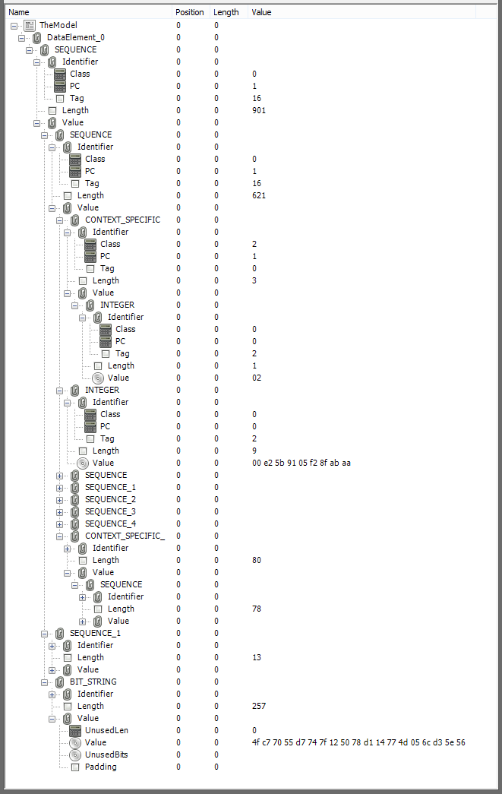

[[Analyzers_Asn1]]

== ASN.1 Analyzer

Converts Abstract Syntax Notation One (ASN.1) into a full DataModel. The analyzer can convert from DER, CER, and BER type ASN.1 encodings. This analyzer can only be used on Blob types.  

=== Syntax

[source,xml]
----
<Blob name="BinaryData"> 
	<Analyzer class="Asn1" />
</Blob>
----

=== Attributes

_Required:_

There are no required attributes.

_Optional:_

There are no optional attributes.

==== Examples

.Simple Hello World Example
==========================
This example uses the Asn1 analyzer on an inline value. 

[source,xml]
----

<?xml version="1.0" encoding="utf-8"?>
<Peach xmlns="http://peachfuzzer.com/2012/Peach" xmlns:xsi="http://www.w3.org/2001/XMLSchema-instance"
  xsi:schemaLocation="http://peachfuzzer.com/2012/Peach ../peach.xsd">

	<DataModel name="TheModel">
		<Blob valueType="hex" value="">
			<Analyzer class="Asn1" />
		</Blob>
	</DataModel>

	<StateModel name="TheState" initialState="initial">
		<State name="initial">
			<Action type="output">
				<DataModel ref="TheModel" />
			</Action>
		</State>
	</StateModel>

	<Test name="Default">
		<StateModel ref="TheState"/>
		<Publisher class="ConsoleHex" />
	</Test>
</Peach>
----

Output from this example.
----
> peach -1 --debug example.xml
----

Output in Peach Validator 
----

----
==========================